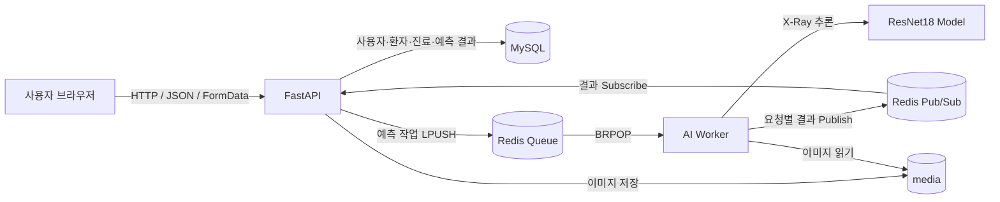

# AI Health Web Service

흉부 X-Ray 이미지와 AI 모델을 활용해 폐렴 예측 결과를 제공하는 팀 프로젝트입니다.
사용자 인증과 권한 관리, 환자·진료기록 관리, X-Ray 업로드, AI 예측을 하나의
FastAPI 웹 서비스로 구성했습니다. 무거운 모델 추론은 웹 API와 분리된 Worker가
담당하며 Redis가 작업과 결과를 전달합니다.

## 현재 완성 범위

| 영역 | 구현 내용 | 상태 |
| --- | --- | --- |
| 사용자 | 회원가입, 로그인, 토큰 재발급, 로그아웃, 마이페이지, 관리자 권한 관리 | 완료 |
| 환자 | 등록, 검색·필터 목록, 상세 조회, 수정, 삭제 | 완료 |
| 진료기록 | 환자별 등록·목록·상세 조회, X-Ray 이미지 업로드 | 완료 |
| AI 예측 | Redis Queue, 별도 AI Worker, 결과 저장·재조회, 중복 저장 방지 | 완료 |
| 웹 화면 | FastAPI API 연동 및 주요 사용자 흐름 확인 | 완료 |
| 인프라 | FastAPI, MySQL, Redis, AI Worker Docker Compose 구성 | 로컬 완료 |
| QA | 자동 테스트와 브라우저 실행 화면 검증 | 로컬 완료 |
| AWS | 운영 배포, HTTPS, 모니터링 | 미진행 |

## 기술 스택

- Backend: Python 3.13, FastAPI, Pydantic
- Database: MySQL 8.0, SQLAlchemy AsyncIO, Alembic
- Authentication: JWT Access Token, HttpOnly Refresh Token, Argon2
- AI: PyTorch, Torchvision, ResNet18, Pillow
- Messaging: Redis List Queue, BRPOP, Pub/Sub
- Frontend: HTML, CSS, JavaScript 정적 페이지
- Infrastructure: Docker, Docker Compose, uv
- Test: pytest, pytest-asyncio, HTTPX, SQLite, Redis

## 시스템 구조



예측 요청은 다음 순서로 처리합니다.

1. FastAPI가 인증, 진료기록, X-Ray 파일, 기존 예측 결과를 확인합니다.
2. 기존 결과가 없으면 요청별 `task_id`를 만들고 Redis Queue에 작업을 넣습니다.
3. AI Worker가 BRPOP으로 작업을 가져와 메모리에 캐시된 모델로 추론합니다.
4. Worker가 요청별 Pub/Sub 채널에 결과를 발행합니다.
5. FastAPI가 결과를 받아 MySQL에 저장하고 클라이언트에 응답합니다.
6. 동일한 `(record_id, ai_model)` 결과는 DB 유일 제약으로 중복 저장을 막습니다.

## 프로젝트 과정 총정리

### 1. Team Rule 정의

프로젝트 시작 전에 협업 방식부터 맞췄습니다.

- 수업 종료 후 매일 15:20~16:00를 코어 타임으로 정했습니다.
- 의견이 다를 때는 쿠션어를 사용하고 감정보다 문제와 근거를 중심으로 이야기했습니다.
- 회의에서는 마이크를 켜고 진행 상황과 막힌 점을 적극적으로 공유했습니다.
- 다른 팀원의 브랜치를 임의로 수정하지 않고 충돌은 작성자와 함께 해결했습니다.
- 커밋은 `타입: 한국어 작업 내용` 형식으로 작성하고 한 커밋에 한 가지 목적만 담았습니다.

자세한 규칙은 [Team Rule](docs/Team_rule.md)에서 확인할 수 있습니다.

### 2. 사용자 요구사항 정의

제공된 요구사항을 바로 코드로 옮기지 않고 사용자, 권한, 입력, 결과, 예외,
비기능 요구사항으로 나누어 읽었습니다.

- 사용자 역할을 `PENDING`, `STAFF`, `ADMIN`으로 구분했습니다.
- 부서를 `MEDICAL`, `DEV`, `RESEARCH`로 구분하고 기능별 접근 권한을 정했습니다.
- 사용자, 환자, 진료기록, AI 예측의 필수 입력값과 조회 필드를 식별했습니다.
- 잘못된 입력, 중복 데이터, 없는 리소스, 권한 부족의 HTTP 상태 코드를 정했습니다.
- 예측 모델은 Recall 0.90 이상, Accuracy 0.80 이상을 평가 기준으로 삼았습니다.
- API는 3초 이내 응답해야 한다는 성능 기준을 설계와 테스트에 반영했습니다.

회고 결과, 요구사항의 문장만 확인하는 것보다 화면 동작과 API 계약으로 다시
표현해야 팀원 간 구현 차이를 줄일 수 있었습니다.

### 3. API 명세서 작성

구현 전에 요청·응답 계약을 Markdown 문서로 작성했습니다. Method, Endpoint,
권한, Request Body·Query·Path Parameter, 정상 응답, 오류 응답을 공통 형식으로
정리했습니다.

- [User API 명세서](docs/4일차_user_API_명세서.md)
- [환자·진료기록 API 설계](docs/5일차_환자관리_API_설계.md)
- [폐렴 예측 API 설계](docs/6일차_폐렴예측_API_설계.md)

명세를 먼저 고정하니 프론트엔드와 백엔드가 같은 필드명과 상태 코드를 기준으로
작업할 수 있었습니다. 구현 후 변경된 내용은 명세와 TODO에도 함께 반영했습니다.

### 4. Git & GitHub Branch 전략 구성

학습 초기에는 GitHub Flow를 기준으로 시작했고, 여러 팀원이 같은 일차 과제를
동시에 수행하면서 통합 단계를 추가했습니다.

```text
개인 작업 브랜치
    → 일차별 기준 브랜치(dayN)
        → 통합 브랜치(feature)
            → 안정 브랜치(main)
```

- `main`: 검증과 PR을 통과한 안정 버전
- `feature`: 여러 일차 과제를 모으는 통합 브랜치
- `dayN`: 해당 일차 과제의 공통 시작점
- `<이름>_subN`, `<이름>_dayN`: 팀원별 독립 작업 브랜치

각 팀원은 독립 브랜치에 push하고 PR을 만들었습니다. 같은 과제를 구현한 브랜치는
요구사항 충족도, 회귀 위험, 테스트, 문서 일치도를 기준으로 비교했습니다. Day7~10은
코드리뷰 후 `hyeseong_day10 → feature → main` 순서로 통합했습니다.

- [Git 브랜치 전략](docs/2일차_git_branch_strategy.md)
- [채연님 Day7~10 코드리뷰](docs/code_reviews/채연_Day7-10_코드리뷰.md)
- [혜성님 Day7~10 코드리뷰](docs/code_reviews/혜성_Day7-10_코드리뷰.md)

브랜치의 출발점과 PR base가 다르면 불필요한 변경이나 충돌이 표시된다는 점을
경험했습니다. 이후에는 작업 전에 `fetch --prune`, base 확인, merge-tree 검사를
수행하고 병합 순서를 먼저 합의했습니다.

### 5. 프로젝트 세팅

FastAPI의 역할을 분리하기 위해 계층형 디렉터리 구조를 사용했습니다.

```text
app/
├── apis/           # 라우터, 요청 진입점, 권한 의존성
├── core/           # 환경설정, DB, 보안, Redis, 파일 저장
├── models/         # SQLAlchemy ORM 모델
├── repositories/   # DB 조회·저장
├── schemas/        # Pydantic 요청·응답 모델
├── services/       # 비즈니스 규칙과 트랜잭션
└── main.py         # FastAPI 앱, 라우터·정적 파일 등록
worker/
├── models/         # 학습된 모델 파일
├── model.py        # 모델 로드, 전처리, 추론
└── main.py         # Redis 작업 소비와 결과 발행
```

- 설정값은 Pydantic Settings와 `.env`로 분리했습니다.
- SQLAlchemy AsyncSession을 요청 단위 의존성으로 주입했습니다.
- Alembic migration 계보를 하나로 정리하고 모델 변경을 스키마에 반영했습니다.
- `uv.lock`을 커밋해 팀원과 Docker 환경의 패키지 버전을 고정했습니다.
- 모델 파일은 `worker/models/best_model_resnet18_pure.pth`에 배치했습니다.

구조와 DB 작업 과정은 아래 문서에 정리했습니다.

- [프로젝트 구조 정리](docs/3일차_프로젝트_뜯어보기.md)
- [DB migration 정리](docs/3일차_db_migration.md)

### 6. API 및 AI Worker 작성과 코드 병합

API는 Router → Service → Repository → Model 순서로 책임을 나눴습니다.

| 기능 | 주요 Endpoint | 접근 기준 |
| --- | --- | --- |
| 회원가입·로그인 | `POST /api/v1/auth/signup`, `POST /api/v1/auth/login` | 공개 |
| 토큰 재발급·로그아웃 | `POST /api/v1/auth/token/refresh`, `POST /api/v1/auth/logout` | Refresh Cookie |
| 마이페이지 | `GET/PATCH/DELETE /api/v1/users/me` | 로그인 사용자 |
| 관리자 회원 관리 | `GET /api/v1/admin/users`, `PATCH /api/v1/admin/users/roles` | 관리자 |
| 환자 관리 | `/api/v1/patients` | 승인된 사내 사용자, 등록은 의료진 |
| 진료기록 | `/api/v1/medical-records` | 승인된 사내 사용자, 등록은 의료진 |
| 폐렴 예측 | `/api/v1/medical-records/{record_id}/predictions` | 승인된 사내 사용자 |

AI Worker는 FastAPI 패키지에 의존하지 않고 Redis 작업 메시지와 공유 상수만
사용합니다. 웹 이미지와 Worker 이미지의 의존성도 `app`, `ai` extra로 분리해
FastAPI 이미지에 PyTorch가 불필요하게 설치되지 않게 했습니다.

팀원별 구현은 바로 섞지 않고 독립적으로 리뷰했습니다. 선택한 브랜치에는 Docker
DB 계정 정합성, 자동 migration, 3초 timeout, Redis 오류 처리, 동시 요청 중복
저장 방지와 테스트 호환성 수정까지 반영한 후 PR로 병합했습니다.

### 7. 아키텍처 설계 및 적용

초기에는 FastAPI 요청 안에서 모델을 직접 실행했지만 동시 요청이 늘면 웹 요청과
추론이 서로 영향을 주는 문제가 있었습니다. Day9에 Event-Driven Architecture를
학습하고 Day10에 아래 구조를 적용했습니다.

- FastAPI: 인증, 데이터 검증, 작업 생성, 결과 저장, HTTP 응답
- Redis List: 예측 작업 대기열
- AI Worker: X-Ray 전처리와 폐렴 추론
- Redis Pub/Sub: 요청별 결과 전달
- MySQL: 최종 예측 결과 영속화

Redis Queue가 여러 Worker 사이의 작업 소비를 분산하고 요청별 Pub/Sub 채널이
결과 혼선을 막습니다. 애플리케이션의 선조회와 DB UniqueConstraint를 함께 사용해
동일 진료기록·모델 조합의 중복 결과 저장도 방지했습니다.

설계 과정은 [동시성 문제 해결 아키텍처](docs/9일차_동시성문제_해결을위한_아키텍처설계.md)에
정리했습니다.

### 8. Docker 인프라 파일 작성

로컬 통합 환경은 Docker Compose로 구성했습니다.

| 서비스 | 역할 | 포트 |
| --- | --- | --- |
| `fastapi` | 웹·API 서버, 시작 시 Alembic 적용 | `8000` |
| `mysql` | 애플리케이션 데이터 저장 | 호스트 `3307` → 컨테이너 `3306` |
| `redis` | 예측 Queue와 Pub/Sub | `6379` |
| `ai-worker` | 모델 로드와 X-Ray 추론 | 외부 노출 없음 |

- MySQL과 Redis healthcheck가 통과한 후 FastAPI와 Worker가 시작됩니다.
- FastAPI 시작 시 `alembic upgrade head`가 실행되어 새 DB도 자동 준비됩니다.
- 개발 환경에서는 `media/`를 FastAPI와 Worker가 공유합니다.
- MySQL root 계정과 애플리케이션 일반 계정을 분리했습니다.
- FastAPI와 AI Worker에 서로 다른 Dockerfile과 의존성 묶음을 사용했습니다.

실행 증거는 [단독 Docker 실행](docs/8일차_Docker_단독실행_증거.md)과
[Docker Compose 실행](docs/8일차_Docker_Compose_실행_증거.md)에 남겼습니다.

### 9. AWS 배포

현재 저장소에는 EC2, RDS, ElastiCache, ECR, ALB, Route 53, HTTPS 또는 CI/CD와
관련된 배포 산출물이 없습니다. 따라서 **AWS 배포는 아직 완료되지 않았으며**,
로컬 Docker Compose 검증을 운영 배포 완료로 간주하지 않습니다.

배포 단계에서는 다음 순서가 필요합니다.

1. 운영 구조를 EC2 단일 호스트 또는 ECS 기반으로 결정합니다.
2. MySQL과 Redis를 컨테이너로 운영할지 RDS·ElastiCache로 분리할지 결정합니다.
3. ECR에 FastAPI와 AI Worker 이미지를 각각 push합니다.
4. Secrets Manager 또는 안전한 환경 변수 주입 방식으로 DB·JWT 비밀값을 관리합니다.
5. 영구 `media/` 저장소를 EBS, EFS 또는 S3 중에서 결정합니다.
6. Alembic을 배포당 한 번만 실행하도록 release 단계 또는 전용 작업으로 분리합니다.
7. Security Group은 필요한 포트만 허용하고 ALB에 HTTPS 인증서를 연결합니다.
8. CloudWatch 로그·지표·알람과 백업·복구 절차를 설정합니다.
9. 운영 URL에서 smoke test와 rollback 절차를 검증합니다.

### 10. QA 진행

QA는 문서 검토, 자동 테스트, 실제 화면 확인, 인프라 설정 검증으로 나눴습니다.

- 요구사항과 API 응답 필드·상태 코드를 비교했습니다.
- 회원, 환자, 진료기록, 예측 API를 pytest와 HTTPX로 검증했습니다.
- 실제 Redis를 연결해 Queue·Pub/Sub 왕복, timeout, 연결 장애, 다중 Worker를 확인했습니다.
- 손상 이미지, 경로 이탈, 권한 부족, 없는 데이터, DB commit 실패를 테스트했습니다.
- 동일 예측 동시 요청에서 DB 결과가 하나만 저장되는지 검증했습니다.
- 모델 cold/warm 추론과 API 전체 응답 시간이 3초 이내인지 확인했습니다.
- Day7 주요 사용자 흐름은 브라우저 실행 화면으로 기록했습니다.
- Compose 문법, healthcheck, Alembic 단일 head와 migration SQL을 확인했습니다.

최종 병합 전 로컬 테스트 결과는 다음과 같습니다.

```text
47 passed, 1 skipped
```

skip 1건은 관리자 권한이 없는 Windows에서 심볼릭 링크를 만들 수 없는 경우이며,
지원되는 환경에서는 경로 이탈 보안 테스트가 실행됩니다. AWS 배포가 끝나면 운영
환경의 회원가입·로그인·환자 등록·X-Ray 업로드·예측 전체 흐름과 장애·복구 테스트를
다시 수행해야 최종 QA가 완료됩니다.

## 실행 방법

### 1. 환경 변수 준비

Windows PowerShell:

```powershell
Copy-Item .env.example .env
```

macOS/Linux:

```bash
cp .env.example .env
```

`.env`의 DB 비밀번호와 `JWT_SECRET_KEY`는 개발 환경에 맞게 변경합니다.
Compose에서 `DB_USER`는 `root`가 아닌 애플리케이션 전용 계정으로 지정합니다.

### 2. Docker Compose 실행

```bash
docker compose up --build
```

- 웹: <http://127.0.0.1:8000/>
- Swagger UI: <http://127.0.0.1:8000/docs>
- Healthcheck: <http://127.0.0.1:8000/healthcheck>

FastAPI 컨테이너가 시작될 때 Alembic migration이 자동으로 적용됩니다.

### 3. 종료

```bash
docker compose down
```

DB와 Redis 데이터까지 초기화하려는 경우에만 팀원과 확인한 뒤 volume 삭제 여부를
결정합니다.

## 로컬 개발과 테스트

```bash
uv sync --extra app --extra ai --group dev
uv run alembic upgrade head
uv run uvicorn app.main:app --reload
```

AI Worker는 Redis가 실행 중인 별도 터미널에서 시작합니다.

```bash
uv run python -m worker.main
```

전체 테스트:

```bash
uv run pytest -q
```

예측 통합 테스트는 Redis의 테스트 전용 DB를 사용하므로 로컬 Redis가 실행 중이어야
합니다.

## Alembic 명령어

모델 변경 후 migration 생성:

```bash
uv run alembic revision --autogenerate -m "변경 내용"
```

최신 스키마 적용:

```bash
uv run alembic upgrade head
```

한 단계 되돌리기:

```bash
uv run alembic downgrade -1
```

## 최종 회고

잘된 점은 요구사항 → 명세 → 구현 → 테스트 → 코드리뷰 → PR이라는 순서를 실제로
반복한 것입니다. 특히 같은 과제를 여러 명이 독립 구현한 뒤 정량적인 기준으로
비교하면서 단순히 코드가 동작하는 것과 팀 코드로 병합하기 좋은 것은 다르다는 점을
확인했습니다.

개선할 점은 브랜치 base와 문서 상태를 작업 시작 전에 더 엄격히 확인하는 것입니다.
설계 문서의 제안과 실제 구현이 달라지거나 Docker의 환경 변수 조합이 어긋난 사례가
있었습니다. 이후에는 PR 템플릿에 요구사항 링크, migration 여부, 환경 변수 변경,
테스트 결과, rollback 방법을 필수 항목으로 두는 것이 좋습니다.

현재 결과물은 로컬 기능 개발과 통합 QA까지 완료된 상태입니다. 다음 완료 기준은
AWS 운영 환경 배포, 비밀값·스토리지·HTTPS·모니터링 구성, 운영 smoke test와 장애
복구 검증입니다.
