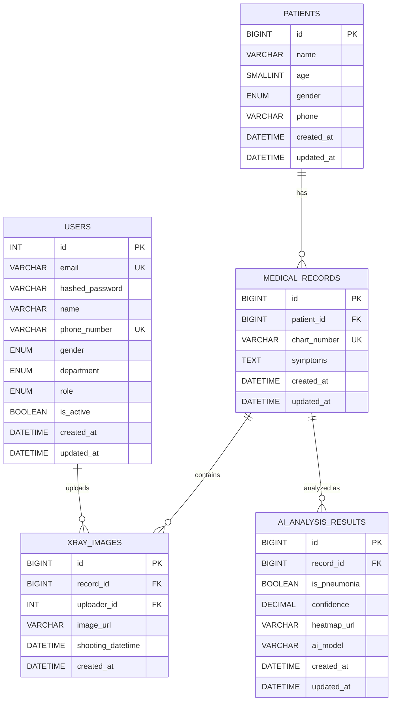

# 3일차 DB 모델 및 마이그레이션

## 1. 데이터베이스 선택

프로젝트 템플릿의 구성을 유지해 **MySQL 8.0**을 사용한다.

선택 근거는 다음과 같다.

- `docker-compose.yml`에 MySQL 8.0 서비스가 정의되어 있다.
- `pyproject.toml`에 MySQL 비동기 드라이버인 `asyncmy`가 포함되어 있다.
- `app/core/db/databases.py`가 `mysql+asyncmy://` 연결 URL을 사용한다.
- FastAPI에서 SQLAlchemy `AsyncSession`을 그대로 활용할 수 있다.

## 2. 구현 파일

ERD의 테이블마다 다음 ORM 모델 파일을 작성했다.

| 테이블 | ORM 모델 파일 | 주요 역할 |
| --- | --- | --- |
| `users` | `app/models/user.py` | 시스템 사용자와 권한 정보 |
| `patients` | `app/models/patient.py` | 환자 기본 정보 |
| `medical_records` | `app/models/medical_record.py` | 환자의 진료 차트와 증상 |
| `xray_images` | `app/models/xray_image.py` | 진료 기록에 첨부된 X-ray 이미지 |
| `ai_analysis_results` | `app/models/ai_analysis_result.py` | AI 폐렴 분석 결과 |

공통 enum은 `app/models/enums.py`, 생성·수정 시각은 `app/core/db/models.py`의 `TimestampMixin`으로 관리한다. `app/models/__init__.py`가 전체 모델을 import하여 Alembic이 모든 테이블의 metadata를 발견할 수 있도록 했다.

초기 migration 파일은 다음과 같다.

```text
alembic/versions/5ed70d40e533_헬스케어_테이블_생성.py
```

## 3. ERD와 구현 스키마



### 관계와 삭제 정책

| 자식 FK | 부모 PK | 삭제 정책 |
| --- | --- | --- |
| `medical_records.patient_id` | `patients.id` | 환자 삭제 시 진료 기록도 삭제(`CASCADE`) |
| `xray_images.record_id` | `medical_records.id` | 진료 기록 삭제 시 X-ray 이미지도 삭제(`CASCADE`) |
| `xray_images.uploader_id` | `users.id` | 사용자 삭제 시 업로더 값만 `NULL` 처리(`SET NULL`) |
| `ai_analysis_results.record_id` | `medical_records.id` | 진료 기록 삭제 시 AI 결과도 삭제(`CASCADE`) |

### ERD 충돌 조정

원본 ERD에는 `users.id`가 `integer`, 이를 참조하는 `xray_images.uploader_id`가 `bigint`로 표시되어 있다. MySQL FK는 참조·피참조 컬럼의 타입과 크기가 호환되어야 하므로 `uploader_id`를 `INTEGER`로 맞췄다.

또한 원본 ERD는 `uploader_id`를 `not null`로 표시하면서 `ON DELETE SET NULL`을 요구한다. 두 조건은 동시에 성립할 수 없으므로 삭제 정책을 보존하기 위해 `uploader_id`를 nullable로 구현했다.

## 4. 환경 설정

프로젝트 루트에 `.env`를 만들고 실제 환경에 맞게 값을 입력한다. `.env`는 `.gitignore`에 포함되어 있으므로 저장소에 올라가지 않는다.

```dotenv
DB_ROOT_PASSWORD=change_root_password
DB_USER=ai_health_user
DB_PASSWORD=change_user_password
DB_HOST=localhost
DB_PORT=3306
DB_NAME=ai_health
```

FastAPI까지 Docker Compose 안에서 실행한다면 `DB_HOST`는 Compose 서비스 이름인 `mysql`을 사용한다. FastAPI는 로컬에서 실행하고 MySQL만 컨테이너로 실행한다면 `localhost`를 사용한다.

## 5. 마이그레이션 실행 방법

### MySQL 실행

```bash
docker compose up -d mysql
```

### 현재 migration 확인

```bash
uv run alembic history
```

### 최신 schema 적용

```bash
uv run alembic upgrade head
```

### 현재 적용 revision 확인

```bash
uv run alembic current
```

정상 적용되면 다음 revision이 표시된다.

```text
5ed70d40e533 (head)
```

### rollback

초기 migration을 되돌리는 명령은 다음과 같다.

```bash
uv run alembic downgrade base
```

다시 최신 상태로 복구한다.

```bash
uv run alembic upgrade head
```

## 6. 실제 MySQL 적용 검증

검증일: **2026-08-26**

기존 개발 DB와 분리한 MySQL 8.0 컨테이너에서 다음 순서로 검증했다.

1. `uv run alembic upgrade head`
2. Alembic revision과 생성 테이블 조회
3. FK의 `ON DELETE` 정책 확인
4. `uv run alembic downgrade base`
5. 애플리케이션 테이블이 모두 제거되었는지 확인
6. `uv run alembic upgrade head` 재적용

`upgrade head` 이후 확인된 테이블은 다음과 같다.

```text
ai_analysis_results
alembic_version
medical_records
patients
users
xray_images
```

`alembic_version.version_num`에는 다음 값이 저장되었다.

```text
5ed70d40e533
```

`xray_images`의 FK도 실제 MySQL에서 다음과 같이 확인했다.

```text
record_id   → medical_records.id  ON DELETE CASCADE
uploader_id → users.id            ON DELETE SET NULL
```

`downgrade base` 이후에는 `alembic_version` 테이블만 남고 version row가 0건인 것을 확인했으며, 재실행한 `upgrade head`도 정상 완료되었다.

## 7. DB Viewer 확인 방법

DBeaver, DataGrip, MySQL Workbench 등의 DB Viewer에서 `.env`와 동일한 접속 정보를 사용한다.

1. `ai_health` database를 선택한다.
2. Tables에서 5개 애플리케이션 테이블과 `alembic_version`을 확인한다.
3. `medical_records`, `xray_images`, `ai_analysis_results`의 Foreign Keys 탭을 확인한다.
4. `users.email`, `users.phone_number`, `medical_records.chart_number`의 unique 제약조건을 확인한다.
5. migration 재적용 후 화면을 새로고침한다.

위 Mermaid ERD는 GitHub에서 schema 확인 이미지로 렌더링되며, 실제 DB Viewer에서도 동일한 테이블과 관계가 보여야 한다.

## 8. 참고 자료

- [과제 ERD](https://dbdiagram.io/d/ai_health_assignment-69d5f55f808962968443c041)
- [SQLAlchemy ORM Quick Start](https://docs.sqlalchemy.org/en/20/orm/quickstart.html)
- [SQLAlchemy Relationship Configuration](https://docs.sqlalchemy.org/en/20/orm/relationships.html)
- [SQLAlchemy asyncio](https://docs.sqlalchemy.org/en/20/orm/extensions/asyncio.html)
- [Alembic Tutorial](https://alembic.sqlalchemy.org/en/latest/tutorial.html)
- [Alembic Autogenerate](https://alembic.sqlalchemy.org/en/latest/autogenerate.html)
