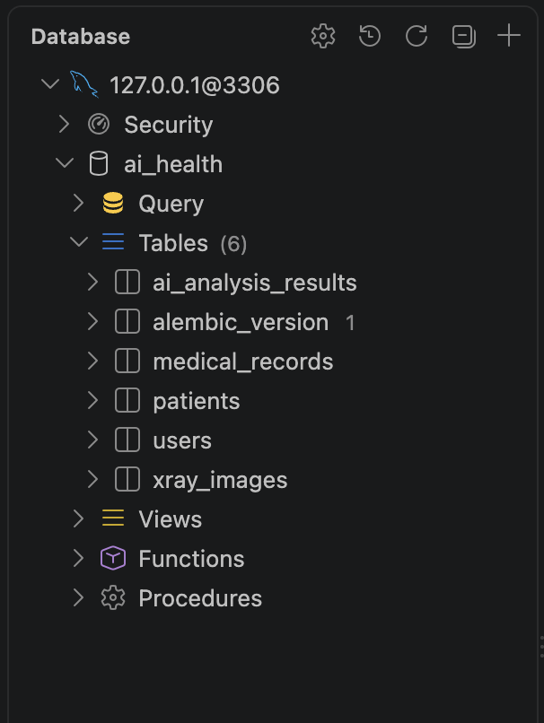

# DB 모델 작성 및 마이그레이션

## 1. 데이터베이스 모델

SQLAlchemy ORM을 사용하여 ERD에 정의된 테이블을 Python 클래스 형태로 작성했다.

- `users`: 사용자 계정과 권한 정보
- `patients`: 환자 기본 정보
- `medical_records`: 환자의 진료 기록
- `xray_images`: 진료 기록에 연결된 X-Ray 이미지
- `ai_analysis_results`: X-Ray 이미지에 대한 AI 분석 결과

각 테이블은 Primary Key를 사용하며, 환자·진료 기록·X-Ray 이미지·AI 분석 결과 사이의 관계는 Foreign Key로 연결했다.

## 2. Alembic 마이그레이션

Alembic을 사용하여 SQLAlchemy 모델의 구조를 데이터베이스 스키마에 반영했다.

```bash
.venv313/bin/alembic upgrade head
```

마이그레이션이 정상적으로 실행되었고, `ai_health` 데이터베이스에 다음 테이블이 생성되었다.

- `users`
- `patients`
- `medical_records`
- `xray_images`
- `ai_analysis_results`
- `alembic_version`

## 3. DB Viewer 확인

Database Client에서 `127.0.0.1@3306`에 연결한 뒤 `ai_health` 데이터베이스의 `Tables` 목록을 확인했다.

