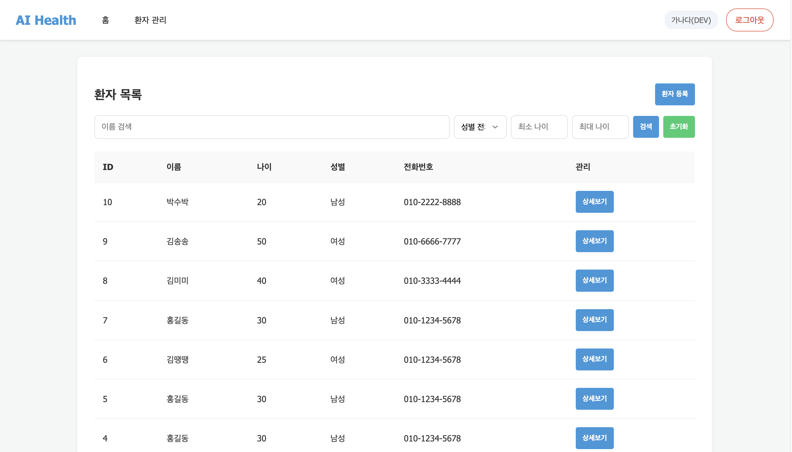
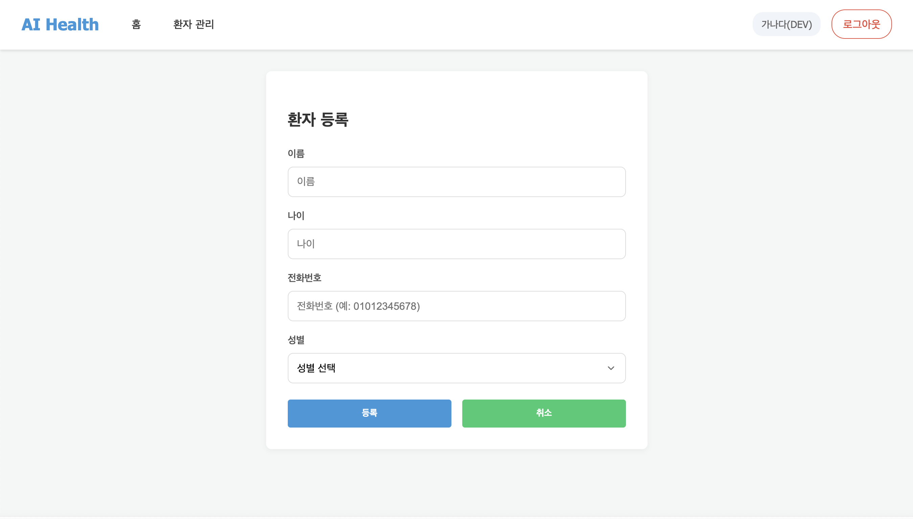
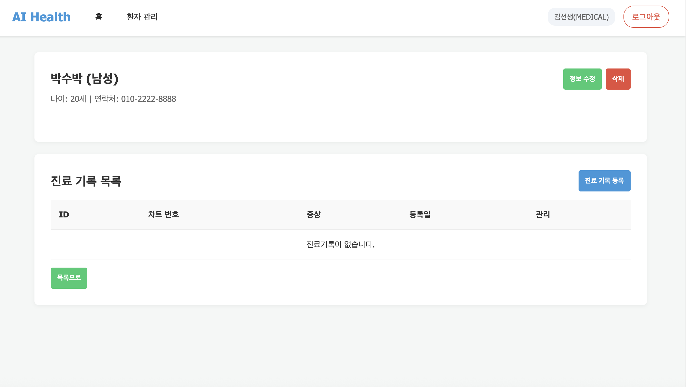
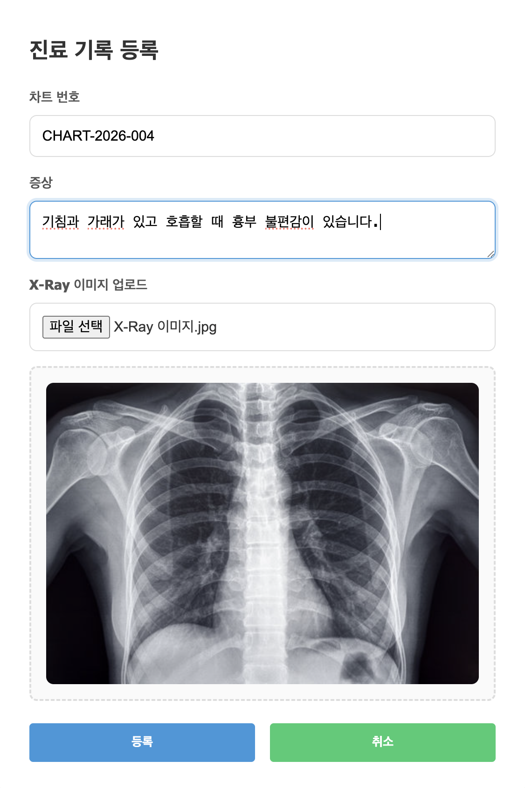
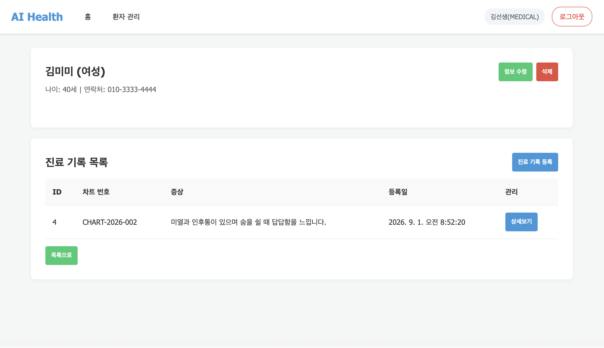
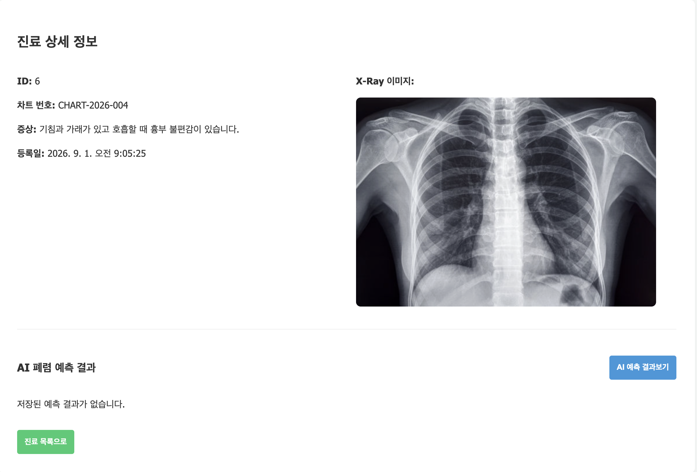
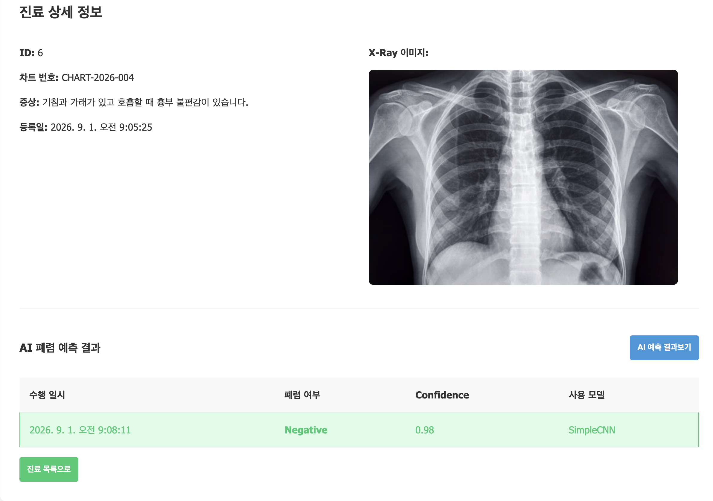

# 7일차 앱 실행 화면

## 실행 환경

실행 명령어:

    fastapi run app/main.py --port 8001

접속 주소:

[http://127.0.0.1:8001/](http://127.0.0.1:8001/)

---

## 1. 환자 목록 조회

환자 관리 화면에서 등록된 환자 목록을 확인할 수 있습니다.

확인 가능한 항목:

- 환자 ID
- 이름
- 나이
- 성별
- 전화번호
- 상세보기 버튼

이름 검색, 성별 필터, 나이 범위 검색 기능을 사용할 수 있습니다.

---

## 2. 환자 등록

환자 등록 화면에서 다음 정보를 입력하여 환자를 등록할 수 있습니다.

- 이름
- 나이
- 전화번호
- 성별

등록 버튼을 클릭하면 환자 정보가 서버에 저장되고 환자 목록에서 확인할 수 있습니다.

---

## 3. 환자 상세 조회

환자 목록에서 상세보기 버튼을 클릭하면 환자의 상세 정보를 확인할 수 있습니다.

확인 가능한 항목:

- 환자 이름
- 성별
- 나이
- 전화번호
- 진료기록 목록

---

## 4. 진료기록 등록

환자 상세 화면에서 진료기록 등록 버튼을 클릭하면 진료기록을 등록할 수 있습니다.

입력 항목:

- 차트 번호
- 증상
- 흉부 X-Ray 이미지

X-Ray 이미지를 선택하면 업로드 전에 이미지 미리보기가 표시됩니다.

---

## 5. 진료기록 목록 조회

환자 상세 화면에서 해당 환자의 진료기록 목록을 확인할 수 있습니다.

진료기록 목록에 표시되는 항목:

- 진료기록 ID
- 차트 번호
- 증상
- 등록일
- 상세보기 버튼

---

## 6. 진료기록 상세 조회

진료기록 상세 화면에서 다음 정보를 확인할 수 있습니다.

- 진료기록 ID
- 차트 번호
- 증상
- 등록일
- X-Ray 이미지
- AI 폐렴 예측 결과

---

## 7. AI 폐렴 예측 결과 조회

진료기록 상세 화면의 AI 예측 결과보기 버튼을 클릭하면 저장된 X-Ray 이미지를 이용한 예측 결과를 확인할 수 있습니다.

예측 결과에 표시되는 항목:

- 예측 수행 일시
- 폐렴 여부
- Confidence
- 사용 모델

예시 결과:

- 폐렴 여부: Negative
- Confidence: 0.98
- 사용 모델: SimpleCNN

---

## 8. 프론트엔드 API 연결 결과

프론트엔드 화면에서 백엔드 API가 정상적으로 연결되는 것을 확인했습니다.

확인한 API:

- 환자 등록 API
- 환자 목록 조회 API
- 환자 상세 조회 API
- 진료기록 등록 API
- 진료기록 목록 조회 API
- 진료기록 상세 조회 API
- AI 폐렴 예측 결과 조회 API

각 API의 응답 결과가 프론트엔드 화면에 정상적으로 표시됩니다.