# 7일차 앱 실행화면

Day 6까지 구현된 FastAPI 백엔드에 `static/` 프론트엔드 템플릿을 연결한 뒤(과제 1), 실제로
`fastapi run app/main.py`로 서버를 띄우고 `http://localhost:8000`에서 각 화면을 직접 조작하며 동작을 확인함.

테스트에 사용한 계정: `live-http-check@example.com`(STAFF, 환자/진료기록/AI예측 테스트용),
관리자 화면(16~18번)만 별도로 임시 생성한 테스트 계정을 ADMIN으로 승격해 확인 후 삭제함.

---

## 1. 회원가입

- **HTTP Method / Endpoint**: `POST /api/v1/auth/signup`
- **프론트엔드에서 수행한 동작**: `/signup` 페이지에서 이메일, 이름, 부서(select: `DEV`/`MEDICAL`/`RESEARCH`), 성별(select: `M`/`F`), 전화번호, 비밀번호를 입력하고 "가입하기" 클릭
- **정상 동작 결과**: "회원가입이 완료되었습니다. 로그인해주세요." 알림 표시 후 로그인 페이지로 이동
- **관련 화면 캡처**:

  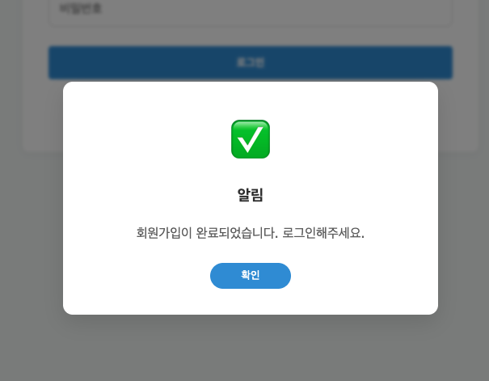

## 2. 로그인 / 4. 환자 목록

- **HTTP Method / Endpoint**: `POST /api/v1/auth/login`, `GET /api/v1/patients`
- **프론트엔드에서 수행한 동작**: `/login`에서 이메일/비밀번호 입력 후 로그인. 로그인 성공 시 자동으로 `/patients`로 이동하며 환자 목록을 조회
- **정상 동작 결과**: 별도 알림 없이 네비게이션이 로그인 상태(사용자명·부서 표시, 로그아웃 버튼)로 바뀌고, 환자 목록이 테이블로 렌더링됨
- **관련 화면 캡처**:

  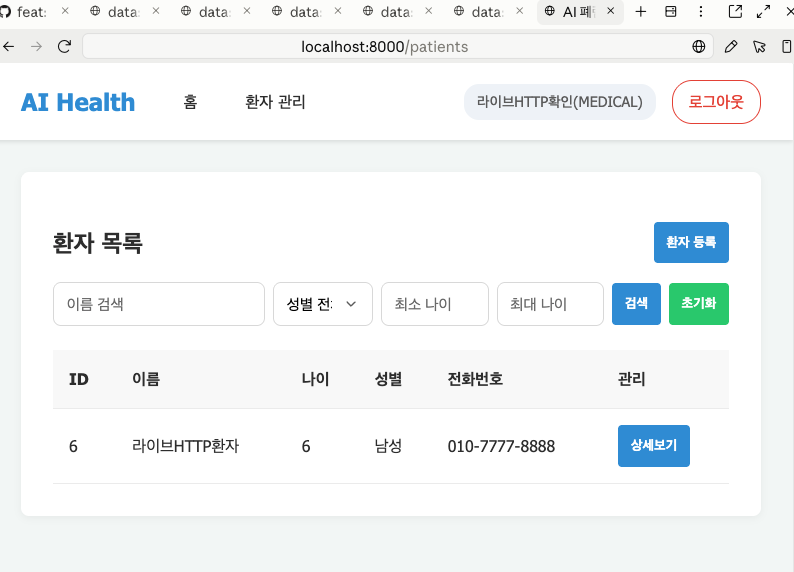

## 3. 로그아웃

- **HTTP Method / Endpoint**: `POST /api/v1/auth/logout`
- **프론트엔드에서 수행한 동작**: 네비게이션의 "로그아웃" 클릭
- **정상 동작 결과**: `POST /auth/logout` 204 응답 후 `/login`으로 이동, 네비게이션이 비로그인 상태로 전환
- **관련 화면 캡처**:

  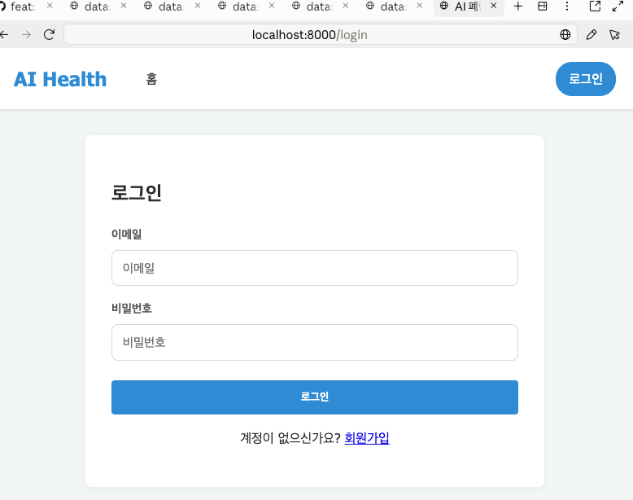

## 5. 환자 검색/필터

- **HTTP Method / Endpoint**: `GET /api/v1/patients?search=&gender=&age_min=&age_max=`
- **프론트엔드에서 수행한 동작**: 환자 목록 화면에서 이름 검색어와 최소 나이를 입력하고 "검색" 클릭
- **정상 동작 결과**: URL 쿼리에 조건이 반영되고, 조건에 맞는 환자만 필터링되어 표시됨
- **관련 화면 캡처**:

  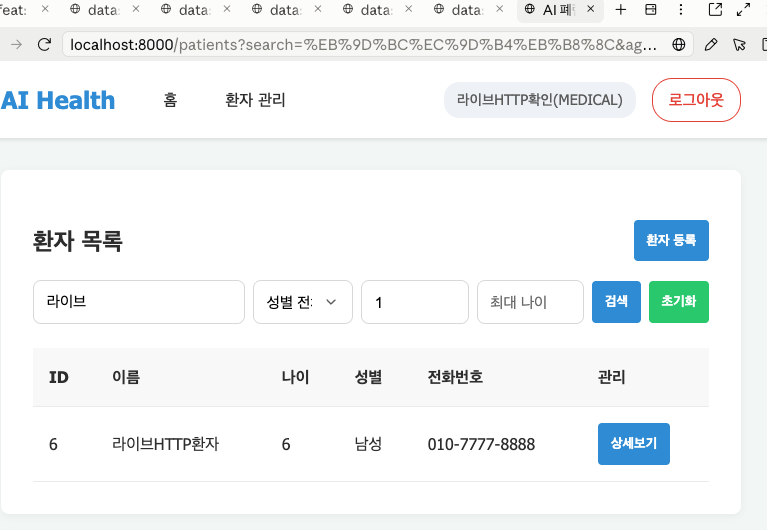

## 6. 환자 등록

- **HTTP Method / Endpoint**: `POST /api/v1/patients`
- **프론트엔드에서 수행한 동작**: "환자 등록" 페이지에서 이름/나이/전화번호/성별 입력 후 "등록" 클릭
- **정상 동작 결과**: "환자가 등록되었습니다" 알림 표시, 환자 목록에 신규 환자 반영
- **관련 화면 캡처**:

  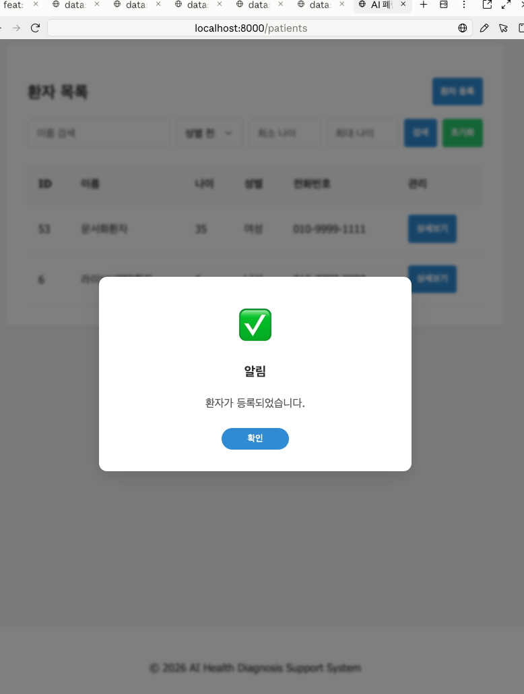

## 7. 환자 상세

- **HTTP Method / Endpoint**: `GET /api/v1/patients/{patient_id}`, `GET /api/v1/patients/{patient_id}/medical-records`
- **프론트엔드에서 수행한 동작**: 환자 목록에서 "상세보기" 클릭
- **정상 동작 결과**: 환자 이름/성별/나이/전화번호와 해당 환자의 진료기록 목록(비어있는 상태)이 함께 표시됨
- **관련 화면 캡처**:

  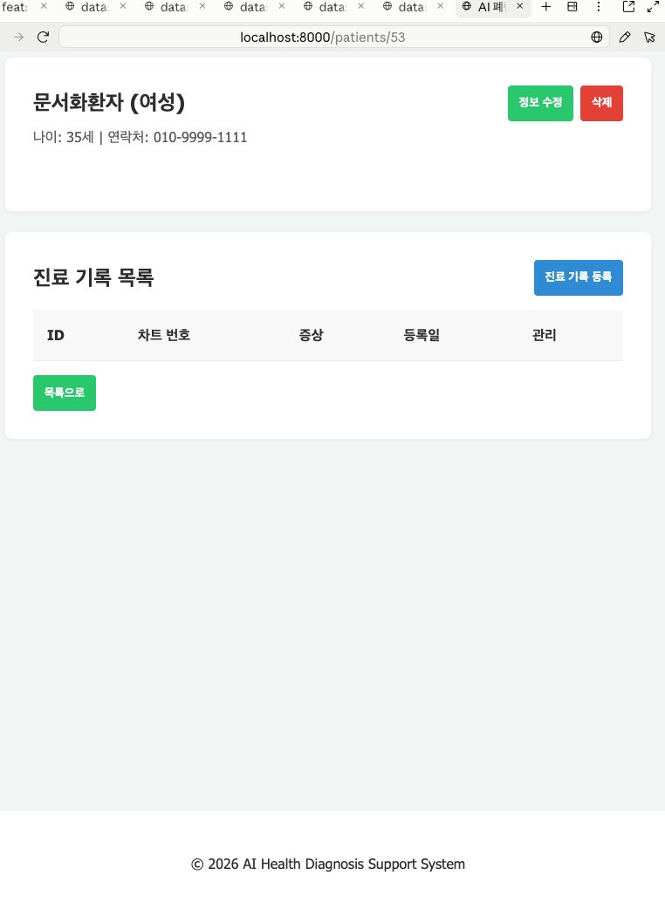

## 8. 환자 수정/삭제

- **HTTP Method / Endpoint**: `PATCH /api/v1/patients/{patient_id}`, `DELETE /api/v1/patients/{patient_id}`
- **프론트엔드에서 수행한 동작**:
  - 수정: 환자 상세 화면에서 "정보 수정" → 이름 변경 후 "수정 완료"
  - 삭제: "삭제" → 확인 모달에서 "확인했습니다" 클릭
- **정상 동작 결과**:
  - 수정: "환자 정보가 수정되었습니다" 알림과 함께 변경된 이름이 즉시 반영됨
  - 삭제: 확인 모달 노출 → "환자 정보와 관련 데이터가 모두 삭제되었습니다" 알림 후 목록에서 제거됨
- **관련 화면 캡처**:

  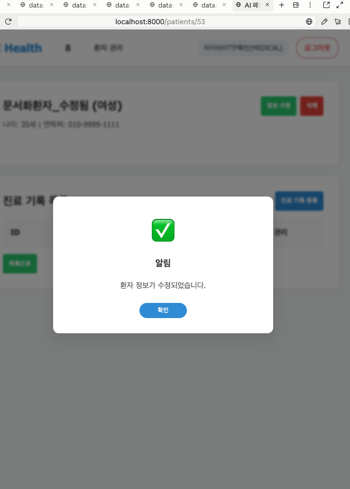
  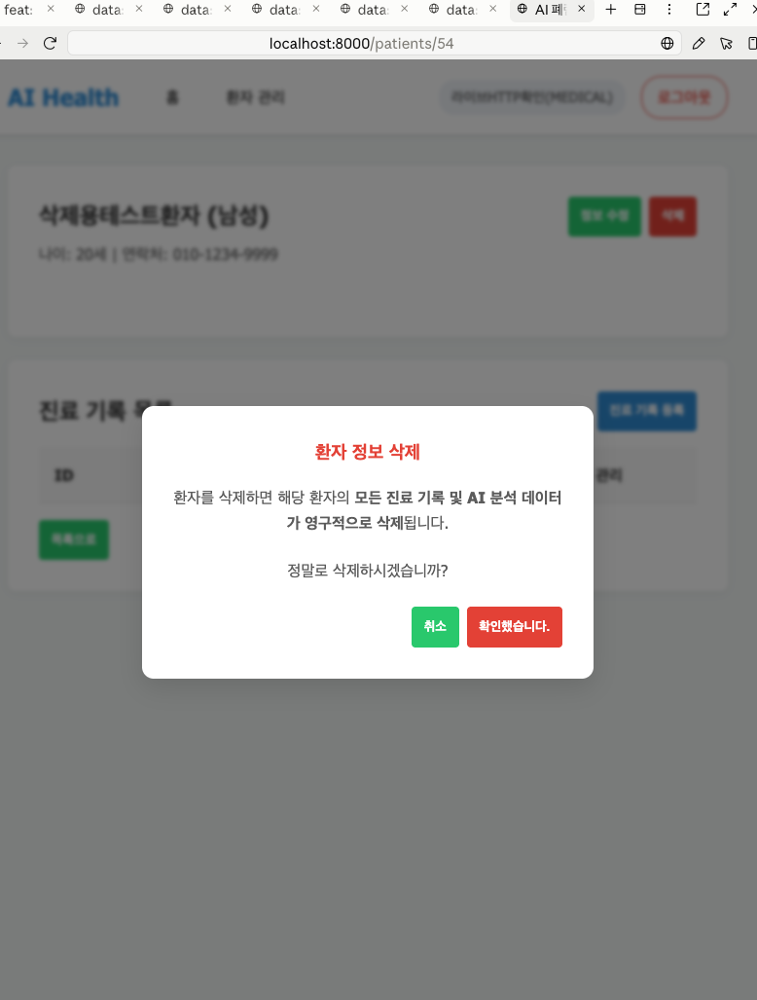
  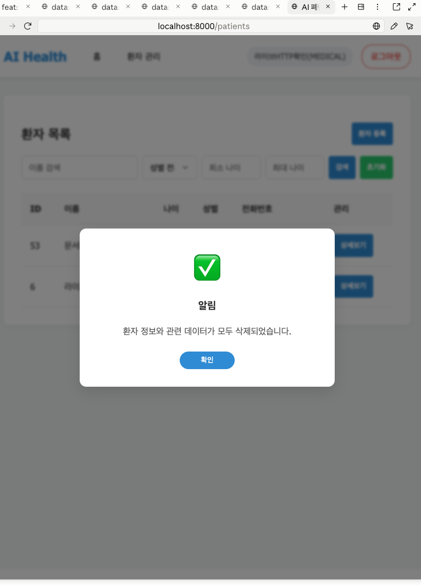

## 9. 진료기록 등록

- **HTTP Method / Endpoint**: `POST /api/v1/medical-records` (multipart/form-data: `patient_id`, `chart_number`, `symptoms`, `xray_image`)
- **프론트엔드에서 수행한 동작**: 환자 상세 화면에서 "진료 기록 등록" → 차트번호/증상 입력, X-Ray 이미지 업로드 → 제출
- **정상 동작 결과**: 등록 성공 후 환자 상세의 진료기록 목록에 새 레코드(차트번호 `DOC-DEMO-001`)가 표시됨
- **관련 화면 캡처**:

  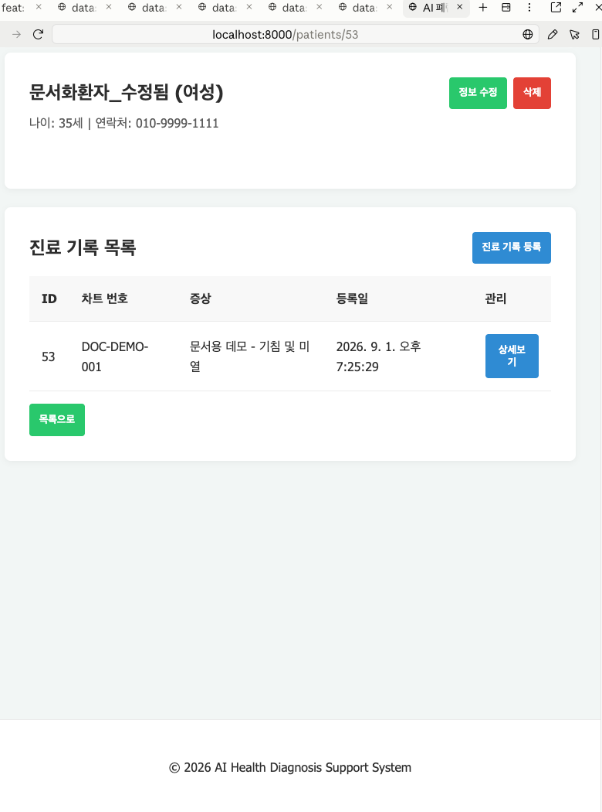

## 10. 진료기록 상세

- **HTTP Method / Endpoint**: `GET /api/v1/medical-records/{record_id}`
- **프론트엔드에서 수행한 동작**: 진료기록 목록에서 "상세보기" 클릭
- **정상 동작 결과**: 차트번호/증상/등록일과 업로드한 X-Ray 이미지(`xray_images`)가 실제로 렌더링되고, 아직 예측 결과가 없는 상태("저장된 예측 결과가 없습니다")가 표시됨
- **관련 화면 캡처**:

  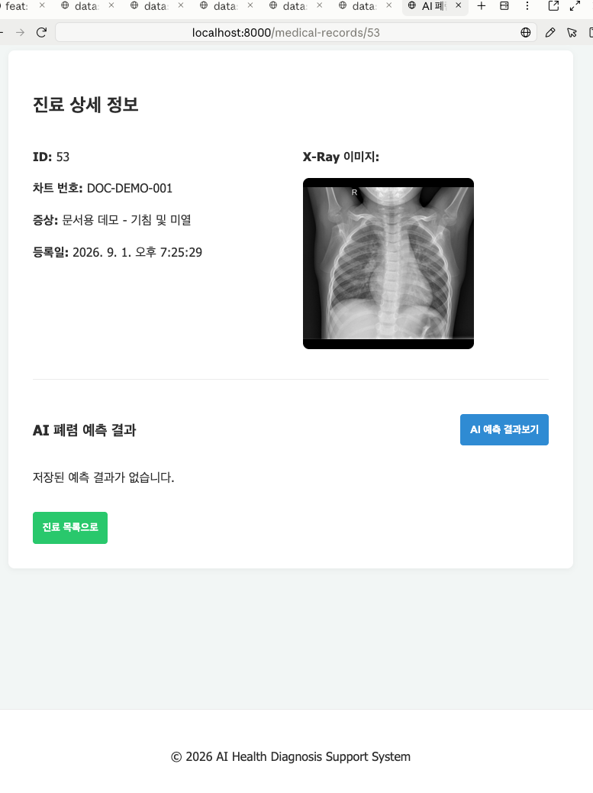

## 11. AI 신규 예측 실행

- **HTTP Method / Endpoint**: `POST /api/v1/medical-records/{record_id}/predictions`
- **프론트엔드에서 수행한 동작**: 진료기록 상세 화면에서 "AI 예측 결과보기" 클릭 (해당 진료기록은 이전에 예측을 수행한 적 없는 신규 기록)
- **정상 동작 결과**: 서버가 신규 추론을 수행해 `201 Created` 응답(캐시 재사용이 아님), "AI 예측이 완료되었습니다" 알림과 함께 결과 테이블에 예측 결과가 추가됨
- **관련 화면 캡처**:

  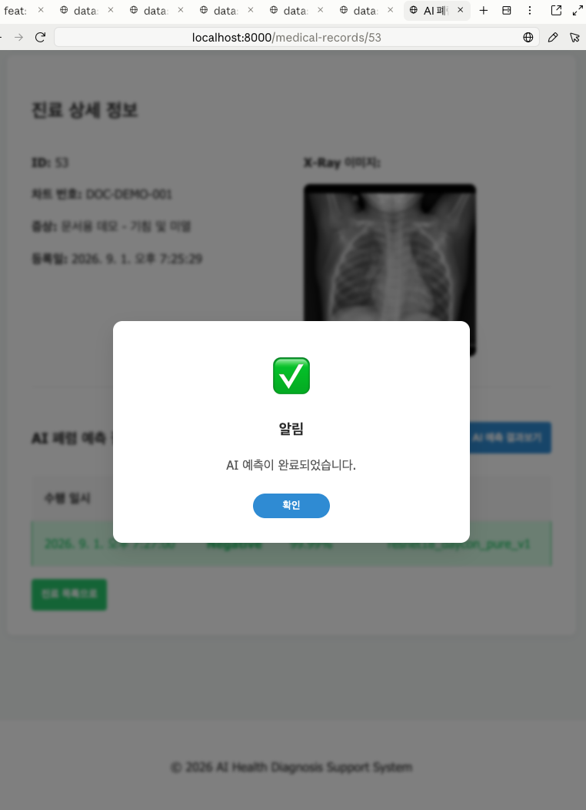

## 12. AI 예측 결과 조회

- **HTTP Method / Endpoint**: `GET /api/v1/medical-records/{record_id}/predictions`
- **프론트엔드에서 수행한 동작**: 진료기록 상세 화면 진입 시 자동 조회
- **정상 동작 결과**: 예측 결과 테이블에 수행 일시(`predicted_at`), 폐렴 여부(`is_pneumonia`: Negative), Confidence(`confidence`: 99.99%), 사용 모델(`model`: `resnet18_daycon_pure_v1`)이 정상 표시됨
- **관련 화면 캡처**:

  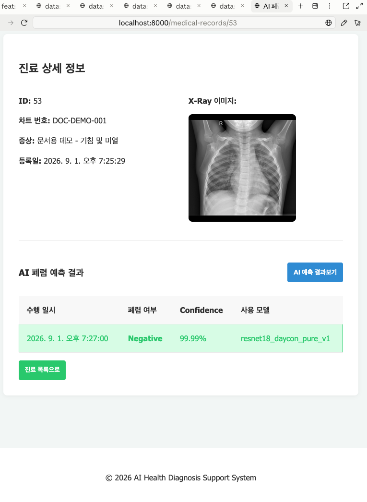

## 13. 마이페이지 조회/수정

- **HTTP Method / Endpoint**: `GET /api/v1/users/me`, `PATCH /api/v1/users/me`
- **프론트엔드에서 수행한 동작**: `/my-page`에서 기본 정보 확인 후, 부서를 `MEDICAL` → `DEV`로 변경하고 "정보 저장" 클릭 (확인 후 원래 값으로 복구)
- **정상 동작 결과**: "회원 정보가 수정되었습니다" 알림과 함께 부서 표시가 즉시 반영됨(네비게이션의 `(DEV)` 표기 포함)
- **관련 화면 캡처**:

  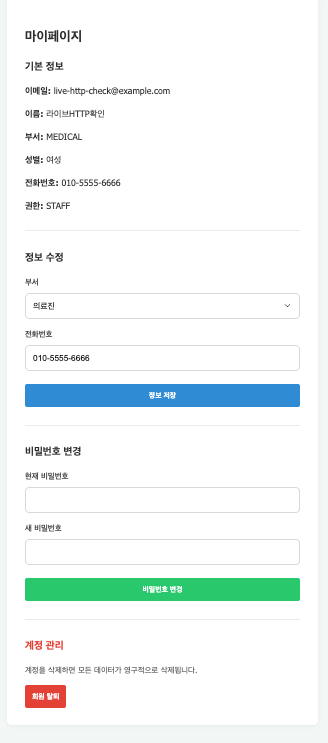
  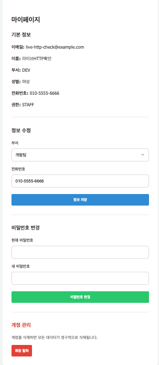

## 14. 비밀번호 변경

- **HTTP Method / Endpoint**: `PATCH /api/v1/users/me/password`
- **프론트엔드에서 수행한 동작**: 마이페이지에서 현재 비밀번호와 새 비밀번호를 입력 후 "비밀번호 변경" 클릭
- **정상 동작 결과**: "비밀번호가 변경되었습니다" 알림 표시. 이후 새 비밀번호로 재로그인이 정상적으로 되는 것까지 확인했고, 테스트 후 원래 비밀번호로 복구함
- **관련 화면 캡처**:

  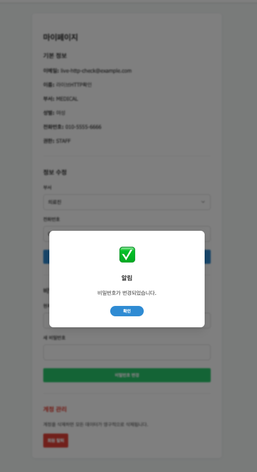

## 15. 회원 탈퇴

- **HTTP Method / Endpoint**: `DELETE /api/v1/users/me`
- **프론트엔드에서 수행한 동작**: 별도 테스트 계정으로 가입 후 마이페이지에서 "회원 탈퇴" 실행
- **정상 동작 결과**: "탈퇴 처리가 완료되었습니다" 알림 표시. DB에서 해당 계정이 실제로 삭제된 것까지 재조회로 확인함
- **관련 화면 캡처**:

  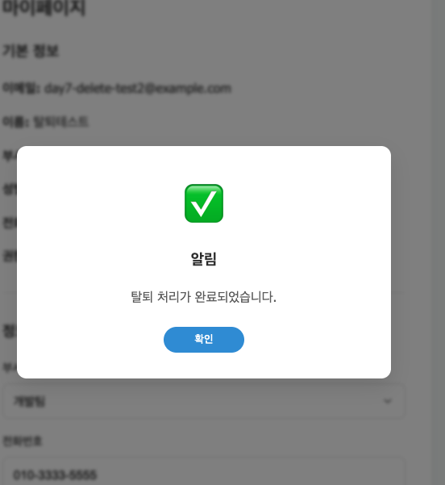

## 16. 관리자 회원 목록

- **HTTP Method / Endpoint**: `GET /api/v1/admin/users`
- **프론트엔드에서 수행한 동작**: ADMIN 권한 계정으로 `/admin/users` 진입
- **정상 동작 결과**: 전체 회원 목록이 테이블로 정상 렌더링됨 (백엔드 응답이 배열이 아닌 `{items, total, page, size}` 객체라서 프론트엔드가 `response.items`를 사용하도록 되어 있어야 하며, 실제로 정상 동작하는 것을 확인함)
- **관련 화면 캡처**:

  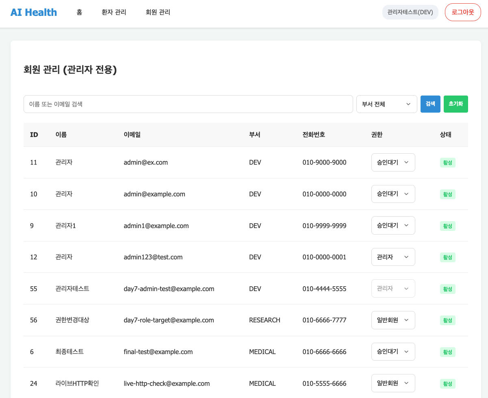

## 17. 관리자 검색

- **HTTP Method / Endpoint**: `GET /api/v1/admin/users?search=&department=`
- **프론트엔드에서 수행한 동작**: 관리자 회원 목록 화면에서 이름/이메일 검색어를 입력하고 "검색" 클릭
- **정상 동작 결과**: 검색어와 일치하는 회원만 필터링되어 표시됨
- **관련 화면 캡처**:

  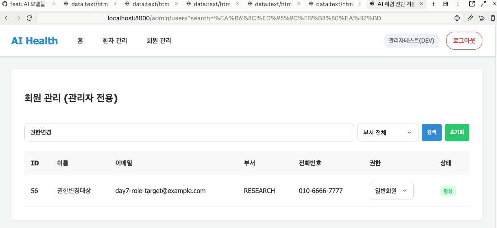

## 18. 관리자 권한 변경

- **HTTP Method / Endpoint**: `PATCH /api/v1/admin/users/roles` (요청 형식: `{user_ids: [...], role: "..."}`)
- **프론트엔드에서 수행한 동작**: 관리자 회원 목록에서 특정 회원의 권한 select를 `STAFF` → `ADMIN`으로 변경
- **정상 동작 결과**: "권한이 변경되었습니다" 알림과 함께 목록의 권한 select 값이 즉시 반영됨
- **관련 화면 캡처**:

  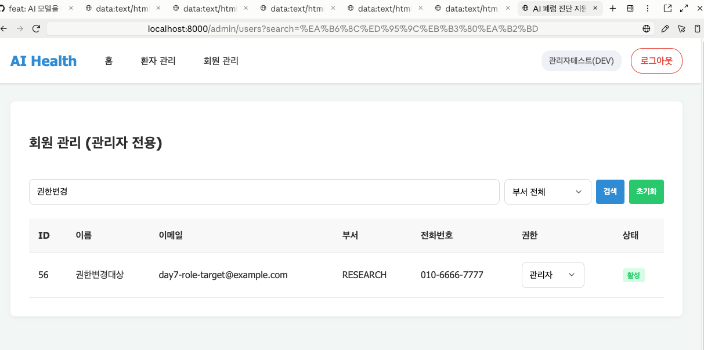

---

