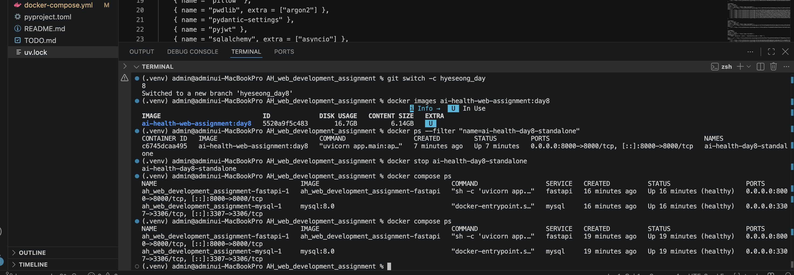
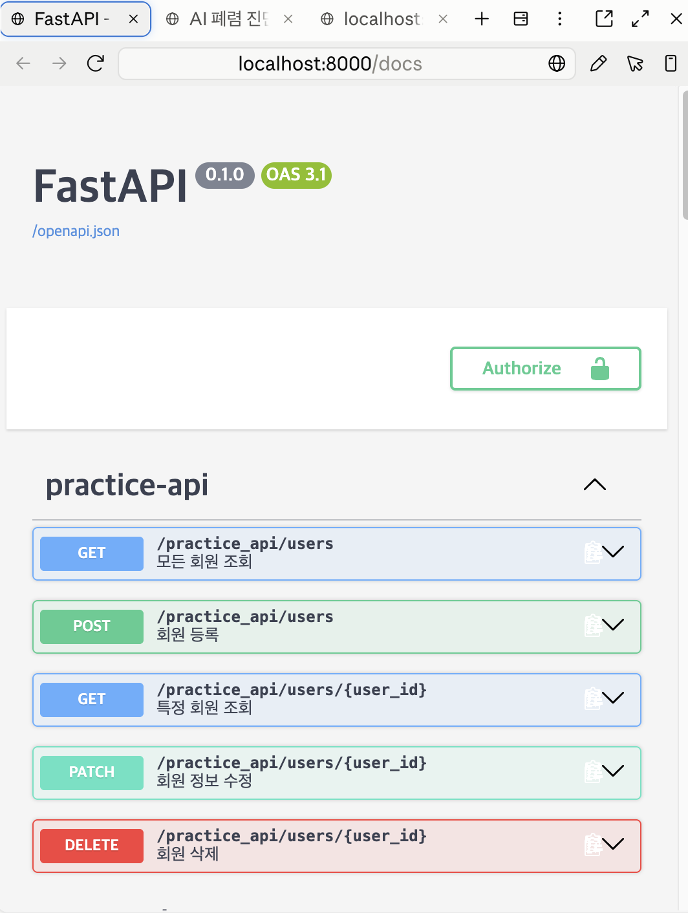

# 8일차 Docker Day1 — docker-compose (fastapi + mysql) 실행 증거

최종 `docker-compose.yml` 기준(mysql 포트 매핑 `3307:3306` 유지)으로 실행한 결과입니다.

- 실행 환경: macOS(Apple Silicon), Docker 29.7.2 / Docker Compose v5.4.0
- 실행 일시: 2026-09-02

---

## 1. `docker compose config --quiet` 성공

```
$ docker compose config --quiet
(출력 없음, exit code 0)
```
문법 오류 및 환경변수(`DB_ROOT_PASSWORD` 등) 미설정 문제 없이 통과.

---

## 2. `docker compose build` 성공

```
$ docker compose build
...
#15 naming to docker.io/library/ah_web_development_assignment-fastapi:latest done
#15 unpacking to docker.io/library/ah_web_development_assignment-fastapi:latest done
#15 DONE 0.1s
 Image ah_web_development_assignment-fastapi Built
```
(레이어 캐시 재사용으로 즉시 완료, 에러 없음)

---

## 3. `docker compose up -d` 성공 + fastapi/mysql 컨테이너 실행 중 + healthy 상태

```
$ docker compose up -d
 Network ah_web_development_assignment_default Created
 Container ah_web_development_assignment-mysql-1 Started
 Container ah_web_development_assignment-fastapi-1 Started
```

```
$ docker compose ps
NAME                                       STATUS                    PORTS
ah_web_development_assignment-fastapi-1   Up 12 minutes (healthy)   0.0.0.0:8000->8000/tcp
ah_web_development_assignment-mysql-1     Up 12 minutes (healthy)   0.0.0.0:3307->3306/tcp
```
**두 서비스 모두 `Up` + `(healthy)`** — fastapi는 Python `urllib` 기반 healthcheck, mysql은 `mysqladmin ping` 기반 healthcheck를 통과한 상태.

**화면 캡처 자리 (터미널에서 `docker compose ps` 실행 화면):**



---

## 4. `localhost:8000/healthcheck` 응답 200

```
$ curl -i http://localhost:8000/healthcheck
HTTP/1.1 200 OK
server: uvicorn
content-type: application/json

{"status":"ok"}
```

**화면 캡처 자리 (브라우저):**


---

## 5. `localhost:8000/docs` 접근 성공

```
$ curl -o /dev/null -w "HTTP %{http_code}\n" http://localhost:8000/docs
HTTP 200
```

**화면 캡처 자리 (브라우저):**



---

## 요약

| 검증 항목 | 결과 |
|---|---|
| `docker compose config --quiet` | ✅ |
| `docker compose build` | ✅ |
| `docker compose up -d` | ✅ |
| fastapi 컨테이너 실행 중 | ✅ `Up` |
| mysql 컨테이너 실행 중 | ✅ `Up` |
| fastapi healthy | ✅ |
| mysql healthy | ✅ |
| `/healthcheck` 200 | ✅ |
| `/docs` 접근 | ✅ |
| mysql 포트 매핑 | `3307:3306` 유지 (호스트 로컬 mysqld와 충돌 없음) |
