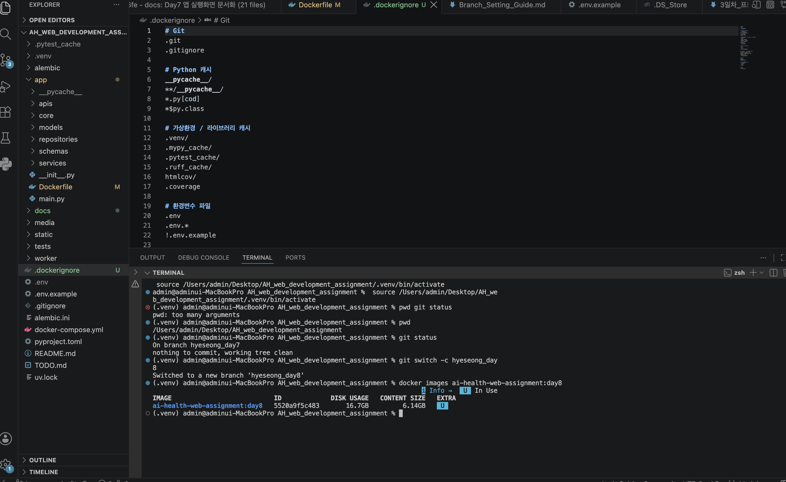
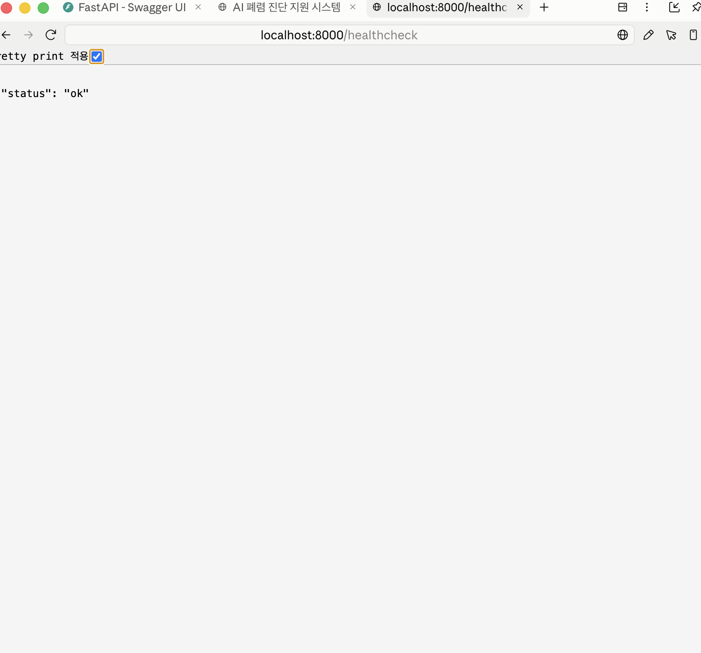
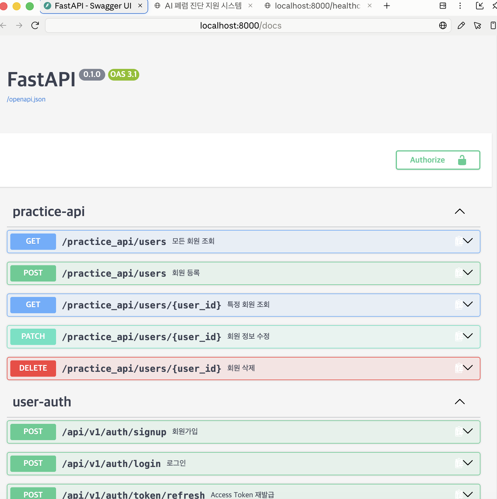
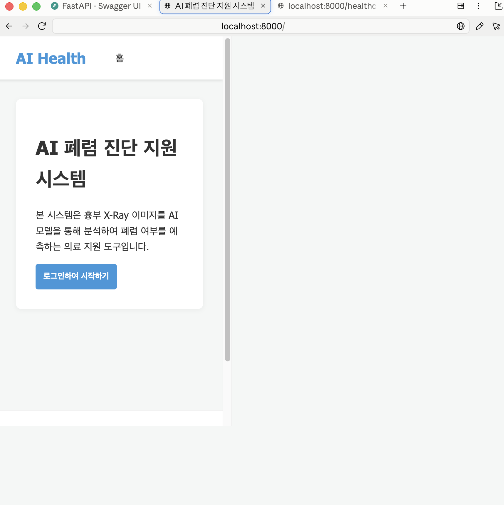

# 8일차 Docker Day1 — 단독 이미지 빌드 및 컨테이너 실행 증거

실제 화면 캡처와, 실행한 명령·결과를 함께 기록합니다.

- 이미지: `ai-health-web-assignment:day8`
- Dockerfile: `app/Dockerfile`
- 실행 환경: macOS(Apple Silicon), Docker 29.7.2 / Docker Compose v5.4.0
- 실행 일시: 2026-09-02

---

## 1. Docker 이미지 빌드 성공

```
$ docker build -f app/Dockerfile -t ai-health-web-assignment:day8 .
...
#12 DONE 361.2s
#13 [stage-0 7/7] COPY . .
#13 DONE 0.5s
#14 exporting to image
#14 naming to docker.io/library/ai-health-web-assignment:day8 0.0s done
#14 unpacking to docker.io/library/ai-health-web-assignment:day8 67.0s done
#14 DONE 317.2s
```

```
$ docker images ai-health-web-assignment:day8
REPOSITORY                 TAG    IMAGE ID       CONTENT SIZE
ai-health-web-assignment   day8   5520a9f5c483   6.14GB
```

에러 로그 0건 (`grep -c "ERROR" 빌드로그` → `0`).

실행 명령:
```
$ docker run -d --name ai-health-day8-standalone --env-file .env -p 8000:8000 ai-health-web-assignment:day8
```

**화면 캡처 — `docker images` (빌드 성공) + `docker ps` (컨테이너 실행 상태, `Up`) 같은 터미널 세션에서 확인:**



---

## 2. 컨테이너 실행 상태 (즉시 종료되지 않고 유지됨)

실행 상태 확인:
```
$ docker ps --filter "name=ai-health-day8-standalone"
CONTAINER ID   IMAGE                           COMMAND                  CREATED         STATUS         PORTS
c6745dcaa495   ai-health-web-assignment:day8   "uvicorn app.main:ap…"   2 minutes ago   Up 2 minutes   0.0.0.0:8000->8000/tcp
```
(위 캡처와 동일한 실행 결과)

컨테이너 로그 (에러 없음, FastAPI 정상 기동):
```
$ docker logs ai-health-day8-standalone
INFO:     Started server process [1]
INFO:     Waiting for application startup.
INFO:     Application startup complete.
INFO:     Uvicorn running on http://0.0.0.0:8000 (Press CTRL+C to quit)
INFO:     ... "GET /healthcheck HTTP/1.1" 200 OK
INFO:     ... "GET /docs HTTP/1.1" 200 OK
INFO:     ... "GET / HTTP/1.1" 200 OK
```

---

## 3. `/healthcheck` 응답 (200)

**화면 캡처:**



```
$ curl -i http://localhost:8000/healthcheck
HTTP/1.1 200 OK
server: uvicorn
content-type: application/json

{"status":"ok"}
```

---

## 4. `/docs` (Swagger UI) 접근 성공

**화면 캡처:**



```
$ curl -D - -o /tmp/docs_body.html http://localhost:8000/docs
HTTP/1.1 200 OK
server: uvicorn
content-type: text/html; charset=utf-8

<!DOCTYPE html>
<html>
<head>
...
<title>FastAPI - Swagger UI</title>
</head>
<body>
<div id="swagger-ui...
```

---

## 5. `/` 응답 및 `static/` 정상 동작

**화면 캡처:**



```
$ curl -D - -o /tmp/index_body.html http://localhost:8000/
HTTP/1.1 200 OK
server: uvicorn
content-type: text/html; charset=utf-8
last-modified: Mon, 24 Aug 2026 06:49:32 GMT

<!DOCTYPE html>
<html lang="ko">
<head>
    <meta charset="UTF-8">
    <title>AI 폐렴 진단 지원 시스템</title>
    <link rel="stylesheet" href="/static/styles.css">
</head>
...
```

컨테이너가 반환한 `/` 응답 본문을 로컬 `static/index.html` 원본과 직접 비교:
```
$ diff static/index.html /tmp/index_body.html
(diff 없음 — 완전히 동일)
```
→ 이미지에 복사된 `static/index.html`이 실제로 정상 서빙되고 있음을 확인. (`/static/styles.css` 등 정적 자원 경로도 이 HTML 안에서 `/static/...`으로 정상 참조됨)

---

## 요약

| 검증 항목 | 결과 |
|---|---|
| `docker build` 성공 | ✅ |
| 컨테이너가 종료되지 않고 유지 | ✅ (`Up`) |
| FastAPI 정상 기동 | ✅ (로그에 "Application startup complete") |
| `/healthcheck` 200 | ✅ |
| `/docs` 접근 | ✅ |
| `/` + `static/` 정상 동작 | ✅ (원본 파일과 바이트 단위 동일 확인) |
| 컨테이너 로그 오류 | 없음 |
