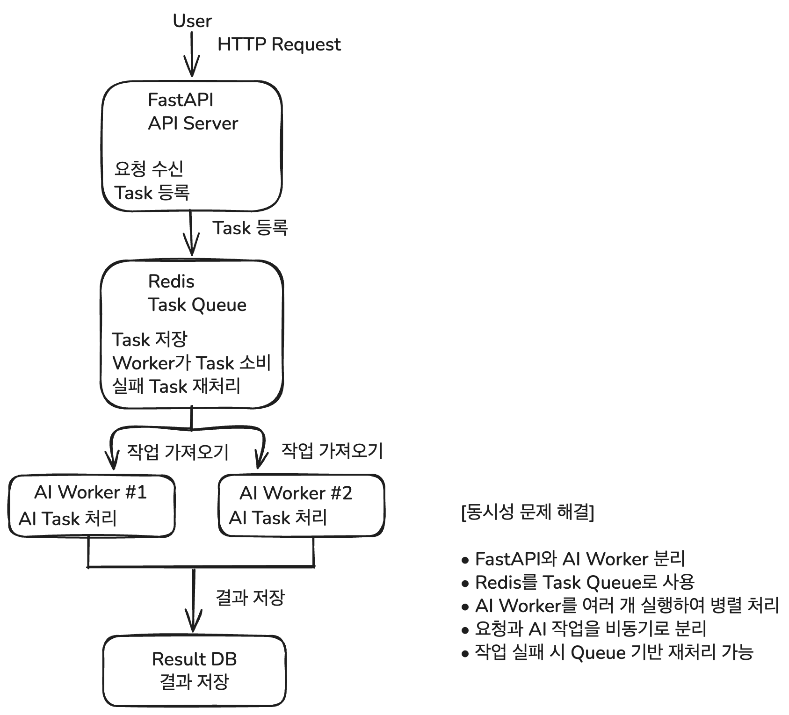

# 9일차 동시성 문제 해결을 위한 아키텍처 설계

## 학습 내용

FastAPI와 Redis를 활용하여 AI 폐렴 예측 요청을 안정적으로 처리하는 Event-Driven Architecture를 설계했습니다.

사용자가 여러 명 동시에 X-Ray 이미지를 업로드하더라도 FastAPI 서버가 AI 모델을 직접 실행하지 않고, Redis 작업 대기열을 통해 AI Worker가 순서대로 처리하도록 구성합니다.

---

## 1. Event-Driven Architecture란?

Event-Driven Architecture는 사용자의 요청이나 시스템에서 발생한 이벤트를 기준으로 각 기능이 동작하도록 구성하는 아키텍처입니다.

이번 프로젝트에서는 다음과 같은 이벤트가 발생합니다.

- 사용자가 진료기록을 등록함
- X-Ray 이미지가 업로드됨
- AI 폐렴 예측 작업이 등록됨
- AI Worker가 예측을 완료함
- 예측 결과가 데이터베이스에 저장됨

FastAPI는 요청을 받고 작업을 등록하는 역할을 수행합니다.

Redis는 AI 예측 작업을 임시로 보관하는 작업 대기열 역할을 수행합니다.

AI Worker는 Redis에서 작업을 가져와 AI 모델을 실행하고 결과를 저장합니다.

---

## 2. 동시성 문제가 발생하는 상황

여러 사용자가 동시에 X-Ray 이미지를 업로드하면 다음과 같은 문제가 발생할 수 있습니다.

- 여러 AI 예측 요청이 동시에 들어올 수 있음
- 같은 진료기록에 대한 예측 요청이 중복될 수 있음
- AI 모델 실행 시간이 길어 API 응답이 지연될 수 있음
- 여러 AI 예측 작업이 동시에 실행되면 CPU와 메모리 사용량이 증가할 수 있음
- FastAPI 서버가 AI 모델 실행까지 담당하면 다른 API의 응답도 느려질 수 있음
- 서버가 재시작되면 처리 중이던 예측 작업이 사라질 수 있음

이러한 문제를 해결하기 위해 API 서버와 AI 모델 실행 작업을 분리합니다.

---

## 3. 전체 처리 흐름

전체적인 처리 순서는 다음과 같습니다.

Client에서 X-Ray 이미지와 진료기록 정보를 전송합니다.

FastAPI 서버는 사용자를 인증하고 진료기록과 이미지의 유효성을 확인합니다.

확인이 완료되면 예측 작업을 Redis 작업 대기열에 등록하고 Client에 작업 등록 결과를 응답합니다.

AI Worker는 Redis 작업 대기열에서 예측 작업을 가져옵니다.

AI Worker는 X-Ray 이미지를 읽고 폐렴 예측 모델을 실행합니다.

예측 결과는 MySQL 데이터베이스에 저장됩니다.

Client가 예측 결과 조회 API를 호출하면 FastAPI 서버가 MySQL에서 결과를 조회하여 반환합니다.

---

## 4. 구성 요소별 역할

### 4-1. Client

웹 브라우저 또는 프론트엔드 애플리케이션입니다.

사용자는 Client를 통해 다음 기능을 사용할 수 있습니다.

- 진료기록 등록
- X-Ray 이미지 업로드
- AI 폐렴 예측 요청
- 예측 처리 상태 조회
- 폐렴 예측 결과 조회

Client는 AI 모델을 직접 실행하지 않고 FastAPI API를 호출합니다.

### 4-2. FastAPI Server

사용자의 HTTP 요청을 처리하는 API 서버입니다.

주요 역할은 다음과 같습니다.

- 사용자 인증
- 환자와 진료기록 확인
- X-Ray 이미지 저장
- AI 예측 작업 중복 여부 확인
- Redis 작업 대기열에 예측 작업 등록
- 예측 결과 조회
- Client에 응답 반환

FastAPI 서버는 AI 모델을 직접 실행하지 않고 AI Worker에 작업을 전달합니다.

### 4-3. Redis

Redis는 빠른 데이터 처리가 가능한 인메모리 데이터 저장소입니다.

이번 설계에서는 AI 예측 작업을 임시로 보관하는 작업 대기열로 사용합니다.

주요 역할은 다음과 같습니다.

- AI 예측 작업 저장
- 작업 처리 순서 관리
- 여러 Worker에게 작업 분배
- 처리되지 않은 작업 관리
- 작업 완료 여부 확인

Redis Streams와 Consumer Group을 사용하면 여러 AI Worker가 작업을 나누어 처리할 수 있습니다.

### 4-4. AI Worker

AI Worker는 Redis에서 예측 작업을 가져와 AI 모델을 실행하는 별도의 프로세스입니다.

주요 역할은 다음과 같습니다.

- Redis에서 예측 작업 가져오기
- X-Ray 이미지 읽기
- 이미지 전처리
- 폐렴 예측 모델 실행
- 폐렴 여부와 Confidence 계산
- 예측 결과를 MySQL에 저장
- 작업 완료 처리

AI Worker는 FastAPI 서버와 별도로 실행됩니다.

### 4-5. MySQL Database

프로젝트에서 사용하는 데이터를 영구적으로 저장합니다.

저장하는 데이터는 다음과 같습니다.

- 사용자 정보
- 환자 정보
- 진료기록
- X-Ray 이미지 경로
- AI 예측 결과
- 폐렴 여부
- Confidence
- 사용 모델
- 예측 상태
- 예측 수행 시간

---

## 5. 예측 작업 처리 과정

### 5-1. 예측 요청

사용자가 진료기록 상세 화면에서 AI 예측 버튼을 클릭합니다.

FastAPI 서버는 다음 API 요청을 받습니다.

    POST /api/v1/medical-records/{record_id}/predictions

FastAPI 서버는 다음 항목을 확인합니다.

- 로그인한 사용자인지 확인
- AI 예측 권한이 있는지 확인
- 진료기록이 존재하는지 확인
- X-Ray 이미지가 등록되어 있는지 확인
- 같은 진료기록에 대한 예측 작업이 진행 중인지 확인

### 5-2. Redis 작업 대기열 등록

FastAPI 서버는 예측 작업을 데이터베이스에 저장합니다.

처음 작업이 등록되면 상태는 `PENDING`으로 저장합니다.

작업 정보는 Redis 작업 대기열에 등록합니다.

예측 작업에 포함되는 정보는 다음과 같습니다.

- 진료기록 ID
- X-Ray 이미지 경로
- 사용할 모델 이름

FastAPI 서버는 AI 예측이 끝날 때까지 기다리지 않고 작업 등록 결과를 먼저 응답합니다.

예시 응답:

    {
      "record_id": 3,
      "status": "PENDING",
      "message": "AI 예측 작업이 등록되었습니다."
    }

### 5-3. AI Worker 작업 처리

AI Worker는 Redis 작업 대기열에서 작업을 가져옵니다.

작업을 가져오면 예측 상태를 `PROCESSING`으로 변경합니다.

그 후 다음 순서로 작업을 처리합니다.

- X-Ray 이미지 파일 확인
- 이미지 크기 조정
- 이미지 색상 변환
- 이미지 Tensor 변환
- AI 모델 실행
- 폐렴 여부 계산
- Confidence 계산
- 예측 결과 저장

### 5-4. 예측 결과 저장

AI Worker는 예측이 완료되면 MySQL에 결과를 저장합니다.

예시 결과:

    {
      "record_id": 3,
      "status": "COMPLETED",
      "is_pneumonia": true,
      "confidence": 0.98,
      "model_name": "SimpleCNN"
    }

결과 저장이 완료되면 Redis 작업을 완료 처리합니다.

### 5-5. 예측 결과 조회

Client는 예측 결과 조회 API를 호출합니다.

    GET /api/v1/medical-records/{record_id}/predictions

예측 작업이 진행 중인 경우:

    {
      "record_id": 3,
      "status": "PROCESSING",
      "message": "AI 예측이 진행 중입니다."
    }

예측 작업이 완료된 경우:

    {
      "record_id": 3,
      "status": "COMPLETED",
      "is_pneumonia": true,
      "confidence": 0.98,
      "model_name": "SimpleCNN"
    }

예측 작업이 실패한 경우:

    {
      "record_id": 3,
      "status": "FAILED",
      "message": "AI 예측 처리에 실패했습니다."
    }

---

## 6. 예측 상태 관리

예측 작업은 다음 상태로 관리합니다.

| 상태 | 설명 |
| --- | --- |
| `PENDING` | 예측 작업이 등록되어 처리를 기다리는 상태 |
| `PROCESSING` | AI Worker가 예측을 처리 중인 상태 |
| `COMPLETED` | 예측이 정상적으로 완료된 상태 |
| `FAILED` | 예측 처리 중 오류가 발생한 상태 |

예측 상태를 데이터베이스에 저장하면 Client가 현재 작업 상태를 확인할 수 있습니다.

---

## 7. 동시성 문제 해결 방법

### 7-1. Redis 작업 대기열 사용

FastAPI 서버가 AI 예측을 직접 실행하지 않고 Redis 작업 대기열에 등록합니다.

여러 요청이 동시에 들어와도 작업이 Redis에 순서대로 저장되므로 AI Worker가 안정적으로 처리할 수 있습니다.

### 7-2. 중복 예측 방지

같은 진료기록에 대해 이미 `PENDING` 또는 `PROCESSING` 상태의 작업이 있다면 새로운 예측 작업을 등록하지 않습니다.

중복 요청이 발생하면 다음과 같은 응답을 반환합니다.

    {
      "detail": "이미 처리 중인 예측 작업이 있습니다."
    }

이를 통해 같은 이미지에 대한 불필요한 AI 모델 실행을 방지합니다.

### 7-3. Consumer Group 사용

Redis Streams의 Consumer Group을 사용하면 여러 AI Worker가 작업을 나누어 처리할 수 있습니다.

예를 들어 AI Worker가 3개 실행 중이면 각 Worker가 서로 다른 예측 작업을 가져가 처리할 수 있습니다.

이를 통해 동시에 많은 요청이 들어와도 처리량을 높일 수 있습니다.

### 7-4. 작업 완료 후 ACK 처리

AI Worker는 예측 결과를 데이터베이스에 저장한 뒤 Redis 작업을 완료 처리해야 합니다.

작업 처리 전에 완료 처리를 하면 작업이 실제로 완료되지 않았는데도 완료된 것으로 판단할 수 있습니다.

정상적인 순서는 다음과 같습니다.

    작업 가져오기
    ↓
    AI 모델 실행
    ↓
    예측 결과 저장
    ↓
    Redis 작업 완료 처리

### 7-5. 실패 작업 재처리

AI Worker가 작업 중 종료되거나 오류가 발생할 수 있습니다.

이 경우 작업이 완료 처리되지 않은 상태로 남습니다.

Redis에 남아 있는 미처리 작업을 다른 Worker가 다시 가져가 처리하면 작업 유실을 줄일 수 있습니다.

### 7-6. 데이터베이스 상태 확인

예측 작업을 등록하기 전에 데이터베이스에서 해당 진료기록의 최신 예측 상태를 확인합니다.

이를 통해 다음 문제를 방지할 수 있습니다.

- 같은 진료기록에 대한 중복 예측
- 동일한 이미지에 대한 반복적인 모델 실행
- 예측 결과 중복 저장
- 처리 중인 작업의 상태 혼동

---

## 8. FastAPI와 AI Worker의 책임 분리

| 작업 | FastAPI Server | AI Worker |
| --- | --- | --- |
| 사용자 요청 접수 | 담당 | 담당하지 않음 |
| 사용자 인증 | 담당 | 담당하지 않음 |
| 진료기록 확인 | 담당 | 담당하지 않음 |
| X-Ray 이미지 저장 | 담당 | 저장된 이미지 사용 |
| Redis 작업 등록 | 담당 | 등록하지 않음 |
| Redis 작업 수신 | 담당하지 않음 | 담당 |
| AI 모델 실행 | 담당하지 않음 | 담당 |
| 예측 결과 저장 | 담당하지 않음 | 담당 |
| 예측 결과 조회 | 담당 | 담당하지 않음 |
| Client 응답 | 담당 | 담당하지 않음 |

FastAPI는 API 요청과 응답을 담당합니다.

AI Worker는 시간이 오래 걸리는 AI 모델 실행을 담당합니다.

두 작업을 분리하면 AI 모델 실행 중에도 FastAPI 서버가 다른 요청을 처리할 수 있습니다.

---

## 9. 프로젝트 적용 구조

    AH_web_development_assignment/
    ├── app/
    │   ├── apis/
    │   │   ├── patient_apis.py
    │   │   ├── medical_record_apis.py
    │   │   └── prediction_apis.py
    │   ├── services/
    │   │   └── prediction_service.py
    │   ├── repositories/
    │   │   └── prediction_repository.py
    │   ├── core/
    │   │   └── redis.py
    │   └── main.py
    ├── worker/
    │   ├── model.py
    │   └── prediction_worker.py
    └── docs/
        ├── 9일차_동시성문제_해결을위한_아키텍처설계.md
        └── images/
            └── day9_event_driven_architecture.png

각 디렉터리의 역할은 다음과 같습니다.

- `app/apis/`: Client의 API 요청 처리
- `app/services/`: 예측 작업의 전체 흐름 처리
- `app/repositories/`: 데이터베이스 조회 및 저장
- `app/core/redis.py`: Redis 연결 설정
- `worker/model.py`: AI 모델 로딩 및 예측 함수
- `worker/prediction_worker.py`: Redis 작업을 가져와 AI 모델 실행
- `docs/`: 설계 내용과 아키텍처 이미지 문서화

---

## 10. Excalidraw 아키텍처 설계

Excalidraw를 사용하여 다음 구성 요소를 포함한 아키텍처를 작성합니다.

- Client
- FastAPI Server
- MySQL Database
- Redis Queue
- AI Worker
- X-Ray Image
- Prediction Result
- 각 구성 요소 사이의 방향 화살표
- FastAPI 영역과 AI Worker 영역의 구분

설계 흐름은 다음과 같습니다.

    Client
      ↓
    FastAPI Server
      ├── 사용자 인증
      ├── 진료기록 확인
      ├── X-Ray 이미지 저장
      └── Redis Queue에 예측 작업 등록
              ↓
          AI Worker
          ├── Redis 작업 수신
          ├── X-Ray 이미지 읽기
          ├── AI 모델 실행
          └── MySQL에 예측 결과 저장
              ↓
        FastAPI Server
              ↓
            Client

FastAPI Server와 AI Worker는 서로 다른 영역으로 구분합니다.

Redis Queue는 FastAPI Server와 AI Worker 사이에 배치하여 작업 대기열 역할을 나타냅니다.

Excalidraw에서 작성한 아키텍처 이미지는 다음 경로에 저장합니다.

    docs/images/day9_event_driven_architecture.png

---

## 11. 기대 효과

Event-Driven Architecture를 적용하면 다음과 같은 효과를 얻을 수 있습니다.

- 여러 사용자의 AI 예측 요청을 안정적으로 처리할 수 있습니다.
- FastAPI와 AI Worker의 역할을 분리할 수 있습니다.
- AI 모델 실행 시간이 길어도 API 응답 지연을 줄일 수 있습니다.
- Redis를 이용하여 작업 대기열을 관리할 수 있습니다.
- 여러 AI Worker를 실행하여 처리량을 높일 수 있습니다.
- 처리에 실패한 작업을 다시 처리할 수 있습니다.
- 동일한 진료기록에 대한 중복 예측을 방지할 수 있습니다.
- AI 모델을 변경하거나 Worker를 추가하기 쉽습니다.
